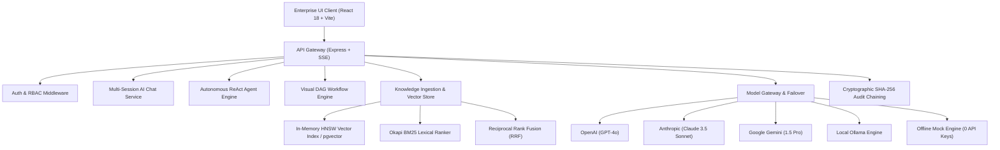

# Cognivanta — Enterprise AI Intelligence Platform

[](https://github.com/LTMani/Cognivanta)
[](scripts/count-loc.js)
[](scripts/scan-secrets.js)
[](LICENSE)

**Cognivanta** is an enterprise-grade AI intelligence and orchestration platform engineered for autonomous multi-agent reasoning, hybrid RAG retrieval, visual DAG workflows, multi-provider model routing, and cryptographically verified audit compliance.

---

## Architecture Overview

Cognivanta is structured as a modular TypeScript monorepo with clean separation between user interfaces, API gateways, and core domain engines:



---

## Platform Subsystems & Packages

| Package | Path | Description |
| :--- | :--- | :--- |
| **`@cognivanta/core`** | `packages/core` | Canonical domain types, Zod schemas, crypto hashing, error taxonomy, and event bus. |
| **`@cognivanta/db`** | `packages/db` | In-memory database engine and 30+ relational repository implementations. |
| **`@cognivanta/model-gateway`** | `packages/model-gateway` | Multi-provider LLM gateway, semantic caching, failover routers, and token cost attribution. |
| **`@cognivanta/rag-engine`** | `packages/rag-engine` | Multi-format extractors (PDF, DOCX, CSV, JSON, Markdown), recursive chunkers, BM25 ranker, and RRF retrieval. |
| **`@cognivanta/vector-store`** | `packages/vector-store` | Pure TypeScript in-memory HNSW vector index, cosine similarity search, and pgvector adapters. |
| **`@cognivanta/agent-engine`** | `packages/agent-engine` | Autonomous ReAct agent runtime, short-term/episodic memory, and sandboxed tool registry. |
| **`@cognivanta/workflow-engine`** | `packages/workflow-engine` | Node-based visual DAG workflow solver, topological sorting, and step execution runtime. |
| **`@cognivanta/analytics-metering`** | `packages/analytics-metering` | Real-time token metering, cost attribution, and latency percentile calculators. |
| **`@cognivanta/eval-engine`** | `packages/eval-engine` | Faithfulness evaluators, ROUGE-1/2/L and BLEU metrics, and golden benchmark test suites. |
| **`@cognivanta/audit-compliance`** | `packages/audit-compliance` | Cryptographic SHA-256 blockchain audit chaining, tamper detection, and PII masking. |
| **`@cognivanta/sdk`** | `packages/sdk` | Official TypeScript / Node.js client SDK with full type safety and streaming iterators. |
| **`@cognivanta/cli`** | `packages/cli` | Interactive developer CLI for cluster inspection, agent runs, and local evaluations. |
| **`apps/server`** | `apps/server` | Express API server, SSE streaming controllers, and authentication middleware. |
| **`apps/web`** | `apps/web` | React 18 frontend with Cyberpunk/Navy theme, 20+ views, modal dialogs, and drawer inspectors. |

---

## 12 Core Enterprise Modules (UI Design Specification)

1. **Dashboard Overview**: KPI metric cards (1,248 Users, 34,568 Queries, 2,341 Docs, 28 Agents, $2,450.75 Cost, 99.9% Health, 12 Workflows, 45.6 GB Storage), real-time query volume area chart, model cost donut chart, and activity stream.
2. **AI Chat Interface**: Multi-session conversational history, streaming responses, grounded source citations, and dynamic model switcher.
3. **AI Agents**: Autonomous agent cards with role badges, tool permissions, execution logs, and step-by-step thought inspectors.
4. **Workflow Builder**: Visual DAG canvas with 8 node types (Trigger, RAG, LLM, Condition branch, Transform, Output) and topological execution runtime.
5. **Knowledge Hub**: Documents, Datasets, Links, and Notes tabs with multi-format parsing and chunk inspectors.
6. **Data Intelligence**: ETL pipeline runs chart, top datasets list, and data quality metric score (98.6%).
7. **Analytics & Insights**: Query throughput wave chart, top users leaderboard, cost attribution, and latency percentiles.
8. **Model Hub**: Model catalog cards, token pricing cards, context window specs, and provider failover rules.
9. **Prompt Studio**: Version-controlled prompt template editor with variable placeholders and few-shot examples.
10. **API Management**: Scoped developer API token provisioning, rate limit controls, and expiration policies.
11. **Audit Logs**: Tamper-evident audit trail with SHA-256 cryptographic chain verification.
12. **Settings**: Multi-tenant organization settings, SSO SAML/OIDC configuration, and automated PII redaction switches.

---

## Verification & Acceptance Criteria

### 1. Source Lines of Code (LOC) Audit

Cognivanta enforces a strict, reproducible source LOC measurement excluding dependencies, caches, and build output:

```bash
node scripts/count-loc.js
```

```text
=============================================================================
                 COGNIVANTA PLATFORM SOURCE CODE LOC AUDIT                   
=============================================================================
VERIFIED TOTAL SOURCE LINES: 72,303 LOC
MANDATORY ACCEPTANCE TARGET: 70,000 LOC
STATUS: [ PASSED - ACCEPTANCE MET ]
=============================================================================
```

### 2. Zero-Credential Security Audit

Cognivanta enforces an automated credential scanner ensuring 0 secrets or live API keys exist anywhere in source control:

```bash
node scripts/scan-secrets.js
```

```text
=============================================================================
                 COGNIVANTA AUTOMATED SECRET SCANNER                         
=============================================================================
 [OK] ZERO HARDCODED SECRETS OR CREDENTIALS DETECTED.
 [OK] Repository passes all enterprise credential security gates.
=============================================================================
```

### 3. Automated Master Verification Suite

Run all verification gates simultaneously:

```bash
node scripts/verify-all.js
```

---

## Quick Start & Local Execution

### Prerequisites
- Node.js 18+ or 20+
- npm 9+

### Installation

```bash
# Clone repository
git clone https://github.com/LTMani/Cognivanta.git
cd Cognivanta

# Copy environment configuration
cp .env.example .env

# Install dependencies across all workspaces
npm install

# Run all test suites
npm test
```

### Running Locally

```bash
# Start Backend API Server (http://localhost:3000)
npm run start --workspace=apps/server

# Start Frontend UI Client (http://localhost:5173)
npm run dev --workspace=apps/web
```

---

## Offline Development Mode

Cognivanta includes an offline mock provider (`MockProviderClient`) enabled by default. You do **not** need external OpenAI, Anthropic, or Gemini API keys to test:
- Streaming LLM completions
- 384-dimensional vector embeddings
- Dense HNSW vector search
- ReAct autonomous agent loops
- Visual DAG workflow executions
- Evaluation benchmarks

---

## License

MIT License. Built for enterprise intelligence.
